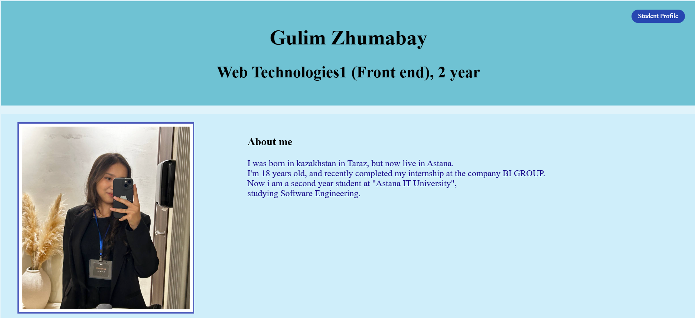
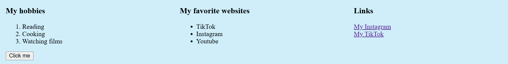
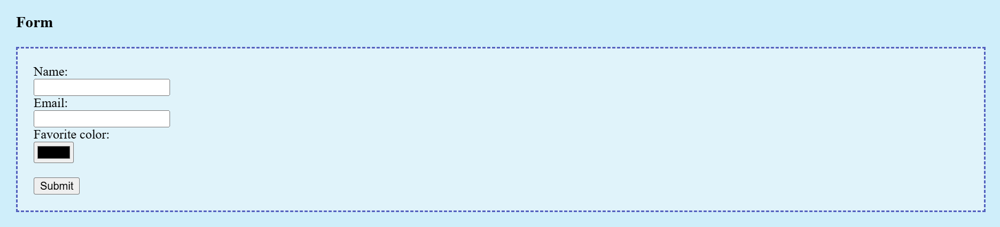
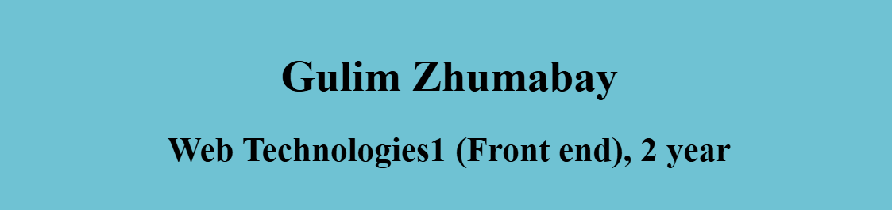
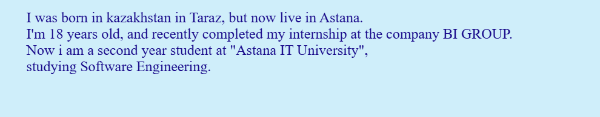
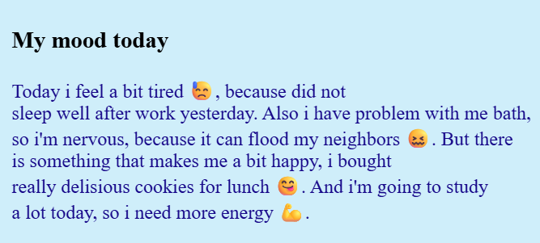
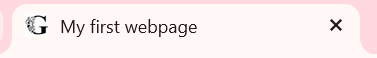
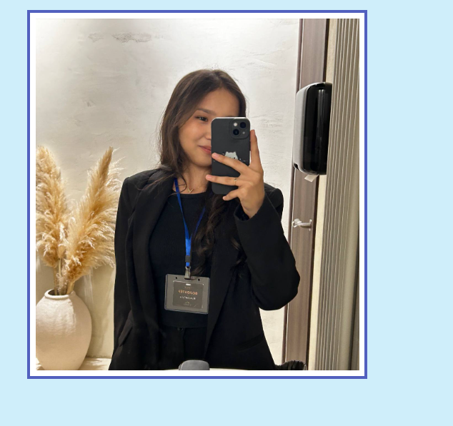

# Student Profile Webpage — Assignment #1

* **Student Name:** Gulim Zhumabay
* **Group / Course:** Software Engineering, 2nd Year
* **Subject:** Web Technologies 1 (Front-end)

---

##  Project Overview
This project is a personal student profile webpage built as part of Assignment #1. The objective is to apply core concepts of **HTML5** and **CSS3**, including text formatting, image positioning, forms, tables, flexbox, box model, CSS positioning, and layout techniques such as `float` and `clear`.

---

##  Work Process Summary
1. **HTML Structure:** Created the basic HTML boilerplate (`index.html`) containing structured tags (`<h1>`-`<h3>`, `
`, `<ol>`, `<ul>`, `<a>`, ``, `<button>`, `<table>`, and `<form>`).
2. **Layout Sections:** Divided the webpage logically into sections using `
` elements: `.header-section`, `.main-section`, and `.footer-section`.
3. **CSS Styling:** 
   - Linked an external stylesheet (`style.css`).
   - Implemented element, ID (`#main-heading`), and class (`.highlight`, `.badge`, `.info-row`, `.info-box`, `.about-text`, `.mood-box`, `.footer-logo`) selectors.
   - Utilized various sizing units (`px`, `%`, `em`, `rem`) and CSS Box Model properties (`margin`, `padding`, `border`).
   - Managed element layout using `position` (`static`, `relative`, `absolute`) and `float` / `clear` techniques for side-by-side positioning.
4. **Interactive & Visual Elements:** Added a contact form, schedule table, emojis, custom favicon, and a footer featuring contact information alongside an Astana IT University logo.

---

##  Assignment Parts & Screenshots

### Part 1: Introduction to HTML
* **Step 0:** HTML boilerplate setup (`index.html`, title "My first webpage").
* **Step 1:** Structured text with headings (`<h1>`-`<h3>`) and personal description.
* **Step 2:** Ordered list `<ol>` (hobbies) and unordered list `<ul>` (favorite websites).
* **Step 3:** Profile image `` and clickable social links `<a>`.
* **Step 4:** Added a simple `<button>`.

---

### Part 2: Intermediate HTML
* **Step 5:** Created a weekly class schedule table with "Subject", "Day", and "Time" columns.
* **Step 6:** Using Tables for Layout *(Optional Challenge)*.
* **Step 7:** Included emoji entities (`&#128531;`, `&#128534;`, `&#128523;`, `&#128170;`) in the "My mood today" section.
* **Step 8:** Created an HTML form with Name, Email, Favorite Color inputs, and a Submit button.

---

### Part 3: Introduction to CSS
* **Step 9 & 10:** Applied inline CSS styling.
* **Step 11 & 12:** Configured internal styles and external stylesheet (`style.css`).
* **Step 13 & 14:** Used Element, Class (`.highlight`), and ID (`#main-heading`) selectors.

---

### Part 4: Intermediate CSS
* **Step 15:** Configured favicon (`favicon.png`).
* **Step 16:** Structured content into `div` sections (`.header-section`, `.main-section`, `.footer-section`) with custom background colors and padding.
* **Step 17:** Applied Box Model properties (borders, margins, padding).
* **Step 18:** Demonstrated CSS positioning (`static`, `relative`, `absolute`).
* **Step 19:** Utilized sizing units (`px`, `%`, `em`, `rem`).
* **Step 20:** Implemented `float: left` (profile image), `float: right` (`.about-text`), and `.clearfix` with `clear: both`.
* **Step 21:** Website deployment via GitHub Pages.

---

## Final Reflection
Completing this assignment helped me gain practical experience in structuring webpages with semantic HTML and styling them using CSS layout principles. I learned how element sizing, positioning, and box model rules affect page design.